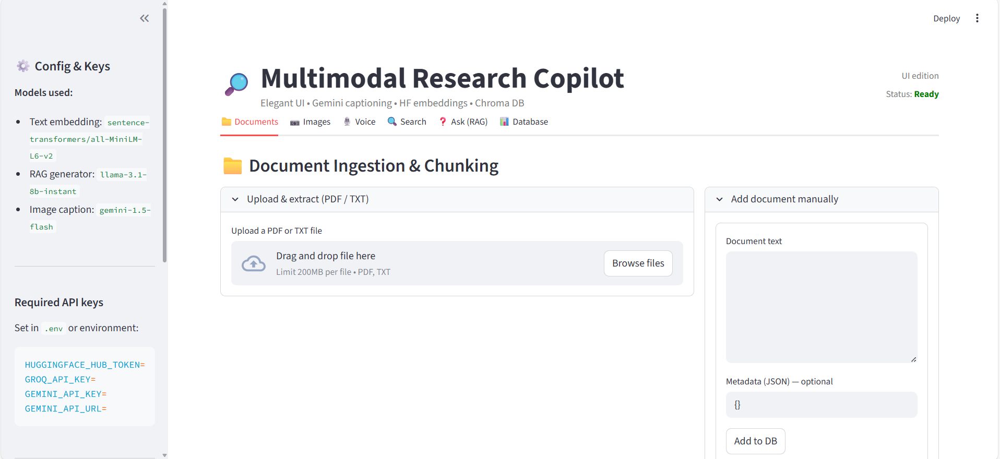
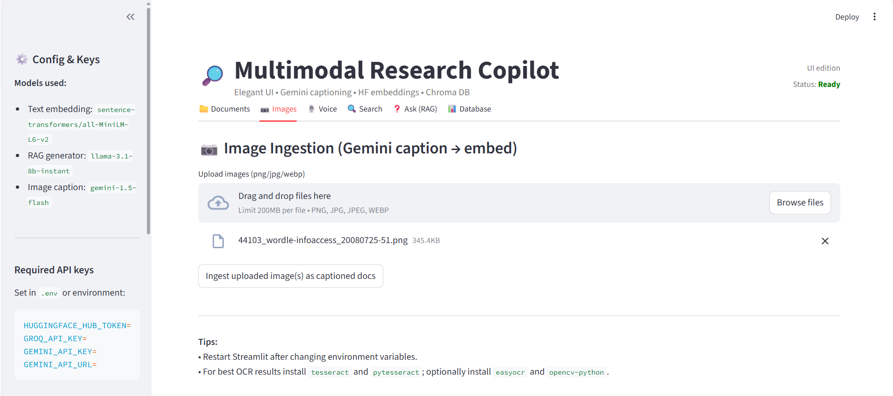
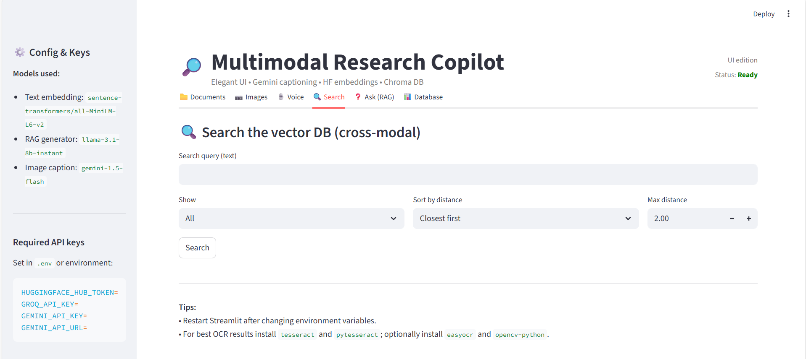

# 🔎 Multimodal Research Copilot

An elegant **Streamlit-based research assistant** that supports **documents, images, and voice queries** with advanced search and RAG (Retrieval-Augmented Generation).  
It integrates Hugging Face embeddings, Gemini image captioning, Groq text generation, and ChromaDB for efficient multimodal search.

---

## ✨ Features

- 📁 **Document ingestion**  
  - Upload PDFs/TXT, extract text (with OCR fallback for scanned PDFs)  
  - Chunk & embed into ChromaDB  
  - Add custom text manually with metadata  

- 📷 **Image ingestion**  
  - Upload images (PNG/JPG/WEBP)  
  - Auto-captioned using Gemini API (`gemini-1.5-flash`)  
  - Captions embedded and stored in vector DB  

- 🎙️ **Voice search**  
  - Upload audio (WAV/MP3/M4A/OGG)  
  - Transcribes speech → converts into a searchable query  

- 🔍 **Cross-modal search**  
  - Search across text & image embeddings  
  - Filter by modality, distance, and export results (CSV/JSON)  

- ❓ **RAG-based Q&A**  
  - Retrieves top chunks from DB  
  - Generates concise answers using Groq LLMs  
  - Shows provenance (supporting context for each sentence)  

- 📊 **Database management**  
  - View stored docs, metadata, stats  
  - Clear and rebuild DB  

---

## 🛠️ Installation

Clone the repo and install dependencies:

```bash
git clone https://github.com/pathareprashant5/multimodal-research-copilot.git
cd multimodal-research-copilot
pip install -r requirements.txt
```

Ensure you have **Tesseract OCR** installed for better PDF text extraction:

- Windows: install from [tesseract-ocr.github.io](https://tesseract-ocr.github.io/)  
- Linux (Debian/Ubuntu):  
  ```bash
  sudo apt install tesseract-ocr
  ```

Optional: for OCR fallback  
```bash
pip install easyocr opencv-python
```

---

## 🔑 Environment Variables

Create a `.env` file in the project root:

```bash
HUGGINGFACE_HUB_TOKEN=your_hf_token_here
GROQ_API_KEY=your_groq_api_key_here
GEMINI_API_KEY=your_gemini_api_key_here
GEMINI_API_URL=https://generativelanguage.googleapis.com/v1beta/models
```

---

## 🚀 Usage

Run the Streamlit app:

```bash
streamlit run streamlit_app_2.py
```

Then open [http://localhost:8501](http://localhost:8501) in your browser.

---

## 📂 Project Structure

```
.
├── streamlit_app_2.py     # Main Streamlit app
├── requirements.txt       # Dependencies
├── uploads/               # Uploaded docs/images (auto-created)
├── chroma_db/             # Vector DB persistence
└── README.md              # Project docs
```

---

## 📌 Use Cases

The Multimodal Research Copilot can be applied in multiple domains:

### 🎓 Academia & Research
- Upload and query research papers, lecture notes, and slides.
- Summarize academic documents with RAG Q&A.
- Search across text + image-based study material.

### 🏢 Corporate Knowledge Base
- Centralized search across company reports, meeting notes, and policies.
- Hands-free voice search for field workers.
- Build a scalable knowledge management system.

### ⚖️ Legal & Compliance
- Ingest contracts, agreements, and case law archives.
- Ask natural language queries and get contextual answers with provenance.
- OCR support for scanned legal documents.

### 🏥 Healthcare & Medical
- Store and query diagnostic guidelines or research publications.
- Combine text documents with medical images (X-rays, scans with captions).
- Enable faster access to treatment protocols.

### 📚 Education & Learning
- Students can query notes, textbooks, and recorded lectures.
- Teachers can share an interactive Q&A system for study materials.
- Chunk large textbooks into searchable knowledge bases.

### 📰 Media & Journalism
- Organize and search press releases, research articles, and transcripts.
- Ingest image-based evidence with auto-captioning.
- Transcribe and search voice notes from interviews.

### 🤝 Customer Support
- Upload product manuals and troubleshooting FAQs.
- Provide customers or agents with instant AI-powered search.
- Support for screenshots and image queries.

### 🧠 Personal Knowledge Management
- Build your own AI-powered second brain.
- Store notes, scanned receipts, and personal docs.
- Search using text, voice, or images.

---

## ⚡ Tips

- Restart Streamlit after editing `.env`  
- OCR fallback can be slow → install `tesseract` for faster extraction  
- Use small Hugging Face models (e.g., `all-MiniLM-L6-v2`) for faster embeddings  
- For production, persist `chroma_db/` to keep your knowledge base  

---

## 📸 Screenshots

### Home UI


### Image Ingestion


### Search & RAG



---

## 📜 License

MIT License.  
Feel free to fork and improve!

---

## 🙌 Acknowledgements

- [Streamlit](https://streamlit.io/)  
- [Hugging Face](https://huggingface.co/)  
- [ChromaDB](https://www.trychroma.com/)  
- [Google Gemini](https://deepmind.google/technologies/gemini/)  
- [Groq](https://groq.com/)  

---
